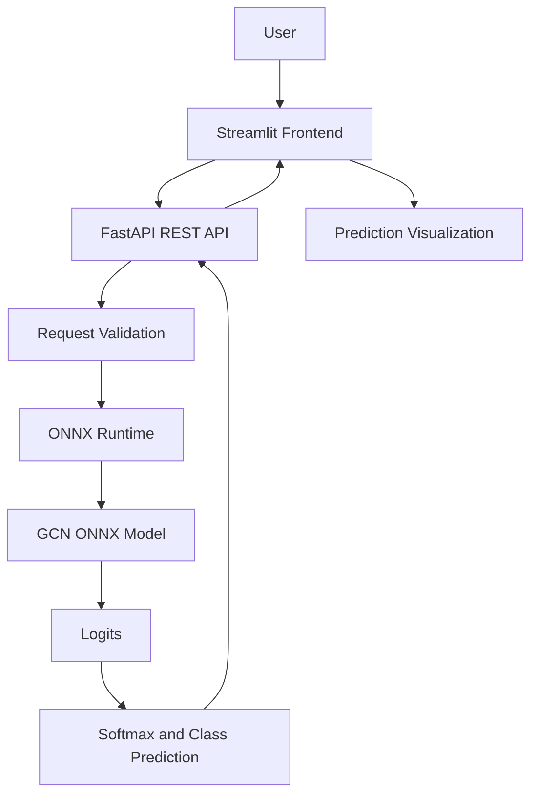

# 🧠 Cora Citation Network Classification Using Graph Convolutional Networks

A graph-based machine learning project that classifies scientific publications into research categories using a **Graph Convolutional Network (GCN)**. The project combines graph representation learning, ONNX model inference, a REST API built with FastAPI, and an interactive Streamlit interface.

The goal is to demonstrate how Graph Neural Networks can learn from both **node features and relationships between nodes** to perform classification on citation networks.

<p align="center">
  
  
  
  
  
  
</p>

---

## 🔍 Project Overview

Scientific publications are connected through citation relationships. Publications discussing related topics may share similar textual features and structural relationships within the citation network.

Traditional machine learning models generally process individual samples as independent feature vectors. However, citation networks contain additional information in the form of connections between papers.

This project uses a **Graph Convolutional Network (GCN)** to classify scientific publications into one of seven research categories. Each paper is represented as a node, its features describe the paper, and its citation relationships are represented as graph edges.

The trained model is exported to ONNX format and served through a FastAPI backend using ONNX Runtime. A Streamlit interface provides a user-facing application for interacting with the model.

### Highlights

- Graph-based node classification using a GCN.
- Scientific publication classification across seven categories.
- Node feature and edge-index inputs.
- ONNX model inference using ONNX Runtime.
- REST API development with FastAPI.
- Interactive frontend using Streamlit.
- API health checks and model metadata endpoints.
- Cloud deployment using Render.

## 🎯 Problem Statement

Classifying research publications based only on their individual features may overlook useful information encoded in the citation network.

The problem is to predict the research category of a publication by leveraging:

1. **Node features:** the numerical feature vector associated with each paper.
2. **Graph structure:** the connections between papers.
3. **Learned representations:** information aggregated from neighboring nodes by graph convolution layers.

The task is a **multiclass node-classification problem** on a citation graph.

## 🎯 Objectives

- Understand graph representation learning and citation networks.
- Work with the Cora dataset using PyTorch Geometric.
- Develop a GCN-based node-classification pipeline.
- Export the model to the interoperable ONNX format.
- Serve predictions through a RESTful API.
- Build an interactive interface for model inference.
- Explore deployment and dependency management for machine learning applications.

## 📚 Understanding the Cora Dataset

The project uses the Cora citation network, a commonly used benchmark for graph-based machine learning research.

The dataset contains scientific publications represented by nodes and citation relationships represented by edges.

| Dataset characteristic | Value |
|---|---:|
| Number of papers (nodes) | 2,708 |
| Number of node features | 1,433 |
| Number of research categories | 7 |
| Number of directed edge entries in the loaded graph | 10,556 |

### Dataset representation

**Node features**

Each paper is represented by a numerical feature vector with 1,433 dimensions.

**Graph edges**

Citation relationships connect papers in the graph. These relationships allow a GCN to aggregate information from neighboring nodes.

**Node labels**

Each publication belongs to one of seven research categories.

These properties are used by the model to perform node classification.

## 🏷️ Research Categories

The model predicts one of the following classes:

| Class ID | Research category |
|---:|---|
| 0 | Case-Based |
| 1 | Genetic Algorithms |
| 2 | Neural Networks |
| 3 | Probabilistic Methods |
| 4 | Reinforcement Learning |
| 5 | Rule Learning |
| 6 | Theory |

## 🕸️ Why Graph Neural Networks?

A conventional neural network processes feature vectors without explicitly representing relationships between samples.

A Graph Convolutional Network incorporates graph connectivity into the learning process. It aggregates information from a node's neighborhood to build representations that account for both features and relationships.

This makes GCNs useful for tasks involving:

- Citation networks
- Social networks
- Knowledge graphs
- Recommendation systems
- Molecular graphs
- Fraud detection networks

In this project, the graph structure helps the model learn representations of scientific publications within their citation network.

## 🧠 Model Architecture

The project uses a Graph Convolutional Network for node classification.

At a high level, the model receives:

- A node-feature matrix.
- An edge-index matrix describing graph connectivity.

The model produces seven output logits for each node.

### High-level inference pipeline

1. Load the node features.
2. Provide the graph's edge indices.
3. Pass the graph through the trained GCN.
4. Obtain the output logits for each node.
5. Apply softmax to convert logits into class probabilities.
6. Select the class with the highest predicted score.

The exact number of GCN layers, hidden dimensions, activation functions, and training hyperparameters should be documented alongside the training notebook when available.

### Prediction output

For each requested node, the API returns information such as:

- Node index
- Predicted class ID
- Predicted class name
- Probability distribution over the seven classes
- Raw output logits

## 🏗️ System Architecture

The application separates the machine learning model from the user interface.



### Component responsibilities

| Component | Responsibility |
|---|---|
| Streamlit | User interface and prediction display |
| FastAPI | HTTP endpoints, request validation, and response formatting |
| ONNX Runtime | Executes the exported model |
| GCN model | Generates node-classification scores |
| PyTorch Geometric | Loads and processes the Cora graph dataset |
| Render | Hosts the backend service |

## 🛠️ Technology Stack

### Programming and data processing

- Python
- NumPy

### Graph machine learning

- PyTorch
- PyTorch Geometric
- Graph Convolutional Networks

### Model deployment

- ONNX
- ONNX Runtime

### Backend

- FastAPI
- Uvicorn
- Pydantic

### Frontend

- Streamlit

### Development and deployment

- Git and GitHub
- Render
- Jupyter Notebook

## 📁 Project Structure

The repository's main components are organized around model experimentation, inference, and application deployment.

```text
cora_project/
│
├── cora_citation_network_classification.ipynb
├── main.py
├── simple_gcn_cora.onnx
├── simple_gcn_cora.onnx.data
├── requirements.txt
├── .gitignore
└── README.md
```

> The `.onnx.data` file contains external model tensor data associated with the ONNX model. Keep it alongside the ONNX file when the exported model depends on it.

The notebook contains the model development workflow, `main.py` serves the API, and the ONNX files are used for inference.

If the Streamlit application is maintained in a separate file or repository, document its location and deployment URL here.

## 📦 Model Export and Inference

After model development, the trained GCN is exported to ONNX format.

ONNX provides a model representation that can be executed by a compatible inference runtime without requiring the original training workflow for every prediction.

### Why ONNX Runtime?

- Separates inference from model training.
- Provides a standardized model exchange format.
- Supports deployment independently of the training notebook.
- Offers a dedicated inference runtime.

The backend initializes an ONNX Runtime session and uses the CPU execution provider.

The model expects inputs with the following structure:

| Input/output | Shape | Data type |
|---|---|---|
| `node_features` | `[num_nodes, 1433]` | Float |
| `edge_indices` | `[2, num_edges]` | Int64 |
| `logits` | `[num_nodes, 7]` | Float |

The actual model inputs and outputs can be inspected through the model information endpoint.

## ⚡ FastAPI Backend

The backend exposes HTTP endpoints for service health, model metadata, and predictions.

### Main capabilities

- Health-check endpoint.
- Model metadata endpoint.
- Prediction for selected nodes in the Cora dataset.
- Prediction for a supplied graph and its node features.
- Input validation and structured JSON responses.
- ONNX Runtime inference.

### Backend endpoints

| Method | Endpoint | Purpose |
|---|---|---|
| GET | `/` | Basic API status |
| GET | `/health` | Service health and inference provider |
| GET | `/info` | Model metadata and tensor specifications |
| POST | `/predict` | Predict classes for a supplied graph |
| POST | `/predict/cora_node` | Predict selected nodes from the Cora dataset |

## 📡 API Documentation

FastAPI automatically generates interactive API documentation.

### Swagger UI

After starting the backend locally, open:

```text
http://127.0.0.1:8000/docs
```

For the deployed service, append `/docs` to its current Render URL.

### 1. Health check

**Request**

```http
GET /health
```

**Example response**

```json
{
  "status": "healthy",
  "providers": [
    "CPUExecutionProvider"
  ]
}
```

### 2. Model information

**Request**

```http
GET /info
```

Returns the model name, feature dimension, class mapping, model inputs, and outputs.

### 3. Predict Cora nodes

**Request**

```http
POST /predict/cora_node
Content-Type: application/json
```

**Example request**

```json
{
  "node_indices": [10]
}
```

The response includes the requested node's predicted class and probability distribution if inference succeeds.

### 4. Predict a custom graph

**Request**

```http
POST /predict
Content-Type: application/json
```

The endpoint accepts a node-feature matrix and an optional edge-index matrix.

**Request structure**

```json
{
  "node_features": [
    [0.0, 0.0, 0.0]
  ],
  "edge_indices": [
    [0, 1],
    [0, 1]
  ]
}
```

**Important:** This is a structural example, not a valid complete Cora request. Actual node-feature vectors must contain exactly 1,433 values per node, and edge indices must refer to valid nodes in the supplied graph.

If no edge indices are provided, the current backend creates self-loop edges. This should not be interpreted as equivalent to providing the original Cora citation graph.

## 🚀 Installation and Setup

### Prerequisites

- Python installed locally.
- Git.
- A code editor such as Visual Studio Code.
- The project repository.
- The ONNX model and any associated external tensor-data files.

### 1. Clone the repository

```bash
git clone https://github.com/MousumiBadyakar/cora_project.git
cd cora_project
```

### 2. Create a virtual environment

**Windows**

```bash
python -m venv .venv
.venv\Scripts\activate
```

**Linux or macOS**

```bash
python3 -m venv .venv
source .venv/bin/activate
```

### 3. Install dependencies

```bash
python -m pip install --upgrade pip
pip install -r requirements.txt
```

Use a Python version supported by the installed PyTorch, PyTorch Geometric, and ONNX Runtime versions. Python 3.12 is a suitable starting point for reproducing the development environment, provided the selected package versions support it.

### 4. Verify model files

Make sure these files are present:

```text
simple_gcn_cora.onnx
simple_gcn_cora.onnx.data
```

The external data file is required if the ONNX model references it.

## ▶️ Running the Application

### Start the FastAPI backend

From the project root, run:

```bash
uvicorn main:app --reload
```

The API should be available at:

```text
http://127.0.0.1:8000
```

Open the interactive documentation:

```text
http://127.0.0.1:8000/docs
```

Check the health endpoint:

```text
http://127.0.0.1:8000/health
```

### Run the Streamlit frontend

If your Streamlit application is in `app.py`, open another terminal, activate the same environment, and run:

```bash
streamlit run app.py
```

Configure the frontend's API base URL to:

```text
http://127.0.0.1:8000
```

If your Streamlit file has a different name or is in another repository, replace `app.py` with the correct file path.

## ☁️ Deployment

The FastAPI backend has been deployed as a Render Web Service.

### Deployment configuration

| Setting | Value |
|---|---|
| Service type | Web Service |
| Runtime | Python |
| Build command | `pip install -r requirements.txt` |
| Start command | `uvicorn main:app --host 0.0.0.0 --port $PORT` |
| Inference provider | ONNX Runtime CPU |

### Backend URL

The backend service currently uses this Render URL:

```text
https://cora-project-jbem.onrender.com
```

Useful endpoints:

- Health: `https://cora-project-jbem.onrender.com/health`
- Model information: `https://cora-project-jbem.onrender.com/info`
- API documentation: `https://cora-project-jbem.onrender.com/docs`

The health and model information endpoints have responded successfully during deployment verification. However, the `/predict/cora_node` endpoint has returned HTTP 502 during testing and should be considered **under troubleshooting** until a successful prediction response is confirmed.

Render's free service may spin down after inactivity, so the first request can take longer than subsequent requests.

### Production considerations

Before presenting the project as fully deployed, verify:

- Successful prediction requests return HTTP 200.
- The backend remains available during inference.
- The model and dataset load reliably.
- The frontend uses the current backend URL.
- Dependency versions are pinned and compatible.
- Error handling and request validation behave as expected.

## ⚠️ Limitations and Future Improvements

### Current limitations

- The prediction endpoint requires further verification under the deployed environment.
- Dataset loading currently occurs inside the Cora-node prediction handler.
- The free hosting tier has limited CPU and memory resources.
- The custom graph endpoint expects correctly formatted feature vectors and edge indices.
- Model quality metrics and training configuration should be documented from the actual experiments.

### Future improvements

- Load and cache the Cora dataset during application startup rather than inside each prediction request.
- Pin dependency versions and use a compatible Python runtime.
- Add automated tests for model inputs, prediction outputs, and API endpoints.
- Add performance benchmarks for inference latency and resource consumption.
- Document training, validation, and test results.
- Add model-confidence visualizations to the frontend.
- Add continuous integration for tests and code quality.
- Improve API error handling and observability.
- Evaluate the model on additional graph datasets.
- Compare GCN performance against non-graph baselines.

## 🎓 Key Learnings

This project provides practical experience with:

- Graph Neural Networks and node classification.
- Citation network representation and graph connectivity.
- PyTorch Geometric dataset processing.
- Model export and ONNX inference.
- REST API development using FastAPI.
- Connecting a machine learning backend to a user interface.
- Cloud deployment and dependency troubleshooting.
- Understanding the differences between a healthy service and a successful prediction pipeline.

## 👩‍💻 Author

**Mousumi Badyakar**

---

<p align="center">
  <b>Built to explore graph-based machine learning and practical model deployment.</b>
</p>
